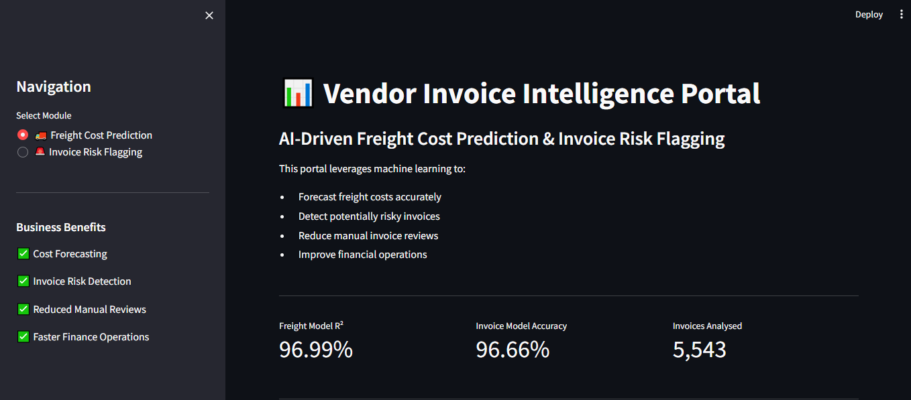
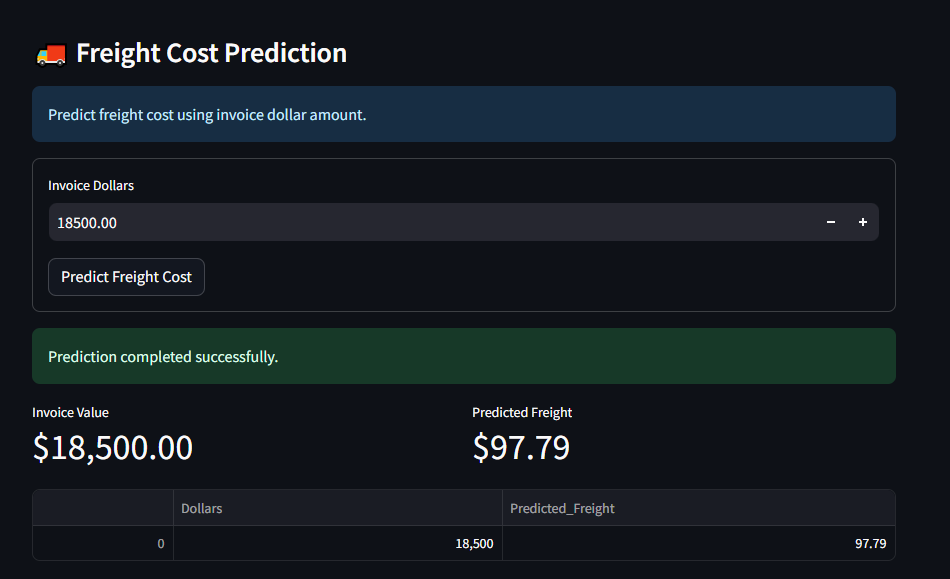
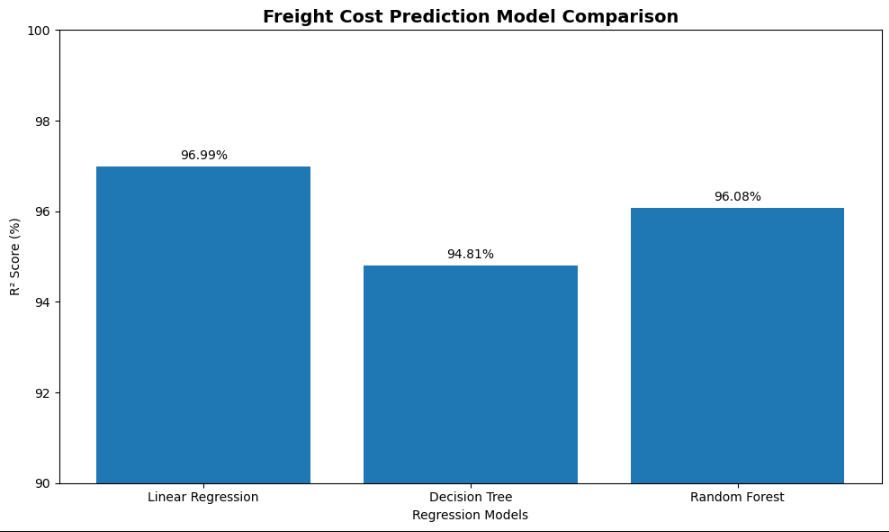
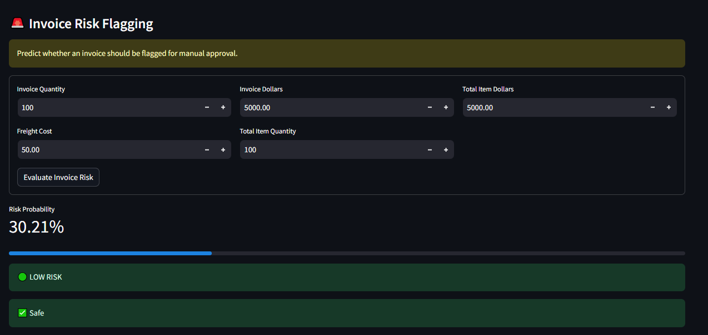
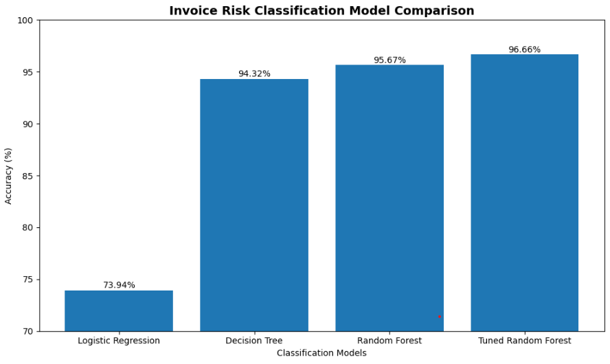

# Vendor Invoice Intelligence Portal

## Overview

Vendor Invoice Intelligence Portal is an end-to-end Machine Learning application designed to automate invoice analysis and support data-driven financial decision-making.

The application leverages machine learning models to:

* Predict freight costs from invoice information
* Identify potentially risky invoices requiring manual review
* Provide real-time predictions through an interactive Streamlit dashboard

---

## Project Highlights

* Developed a Freight Cost Prediction model achieving **96.99% R² Score**
* Built an Invoice Risk Classification model achieving **96.66% Accuracy**
* Evaluated multiple machine learning algorithms including Linear Regression, Decision Trees, Random Forests, and Logistic Regression
* Applied Hyperparameter Tuning using GridSearchCV to improve classification performance
* Designed an end-to-end machine learning pipeline from data preprocessing to deployment
* Developed an interactive Streamlit dashboard for business users

---

## Business Problem

Organizations process thousands of invoices every month. Manual invoice verification is time-consuming and often leads to:

* Delayed approvals
* Inaccurate freight forecasting
* Increased operational costs
* Higher risk of processing problematic invoices

This project addresses these challenges using machine learning-based predictive analytics.

---

## Dashboard Overview



---

## Dataset

The project uses vendor invoice transaction data stored in a SQLite database.

### Features

* Vendor Number
* Vendor Name
* Invoice Date
* PO Number
* PO Date
* Pay Date
* Quantity
* Dollars
* Freight
* Approval Status

### Target Variables

#### Freight Cost Prediction

Target Variable:

* Freight

#### Invoice Risk Classification

Target Variable:

* Flagged Invoice (generated using business rules)

Business rules include:

* Invoice mismatches
* Delayed receiving processes
* Approval-related anomalies

---

## Project Architecture

```text
Vendor Invoice Database (SQLite)
               │
               ▼
        Data Extraction
               │
               ▼
      Data Preprocessing
               │
               ▼
      Feature Engineering
               │
               ▼
 ┌─────────────────────────┐
 │ Freight Cost Prediction │
 │ Regression Pipeline     │
 └─────────────────────────┘
               │
               ▼
 ┌─────────────────────────┐
 │ Invoice Risk Detection  │
 │ Classification Pipeline │
 └─────────────────────────┘
               │
               ▼
      Model Persistence
          (.pkl Files)
               │
               ▼
       Streamlit Dashboard
```

---

## Machine Learning Workflow

1. Data Extraction from SQLite Database
2. Data Cleaning and Validation
3. Feature Engineering
4. Model Training
5. Hyperparameter Optimization
6. Model Evaluation
7. Model Persistence
8. Streamlit Deployment

---

# Freight Cost Prediction

## Objective

Predict freight cost based on invoice information.

## Models Evaluated

* Linear Regression
* Decision Tree Regressor
* Random Forest Regressor

## Model Performance

| Model                   |   MAE |   RMSE | R² Score |
| ----------------------- | ----: | -----: | -------: |
| Linear Regression       | 24.11 | 124.72 |   96.99% |
| Decision Tree Regressor | 32.65 | 163.74 |   94.81% |
| Random Forest Regressor | 28.27 | 142.21 |   96.08% |

## Best Model

### Linear Regression

* MAE: 24.11
* RMSE: 124.72
* R² Score: 96.99%

## Example Prediction



## Model Comparison



---

# Invoice Risk Classification

## Objective

Predict whether an invoice should be flagged for manual approval.

## Models Evaluated

* Logistic Regression
* Decision Tree Classifier
* Random Forest Classifier
* Tuned Random Forest Classifier

## Model Performance

| Model                          | Accuracy |
| ------------------------------ | -------: |
| Logistic Regression            |   73.94% |
| Decision Tree Classifier       |   94.32% |
| Random Forest Classifier       |   95.67% |
| Tuned Random Forest Classifier |   96.66% |

## Best Model

### Tuned Random Forest Classifier

* Accuracy: 96.66%
* Precision: 100%
* Recall: 90%
* F1 Score: 95%

## Example Prediction



## Model Comparison



---

## Business Impact

This solution can help organizations:

* Reduce manual invoice reviews
* Improve freight cost forecasting
* Detect potentially risky invoices earlier
* Improve operational efficiency
* Support data-driven financial decision making

---

## Technology Stack

### Programming Language

* Python

### Data Processing

* Pandas
* NumPy

### Machine Learning

* Scikit-Learn
* Joblib

### Database

* SQLite

### Frontend & Deployment

* Streamlit

---

## Project Structure

```text
vendor-invoice-intelligence/
│
├── assets/
│   ├── dashboard.png
│   ├── freight_prediction.png
│   ├── invoice_prediction.png
│   ├── freight_model_comparison.png
│   └── invoice_model_comparison.png
│
├── data/
├── models/
├── notebooks/
│
├── src/
│   ├── freight_cost_prediction/
│   ├── invoice_flagging/
│   └── inference/
│
├── app.py
├── requirements.txt
├── README.md
└── .gitignore
```

---

## Installation

### Clone Repository

```bash
git clone https://github.com/harshad3322/vendor-invoice-intelligence.git
```

```bash
cd vendor-invoice-intelligence
```

### Install Dependencies

```bash
pip install -r requirements.txt
```

---

## Run Application

```bash
streamlit run app.py
```

---

## Future Improvements

* SHAP Explainability
* FastAPI Integration
* Docker Containerization
* CI/CD Pipeline
* Cloud Deployment (AWS / Azure / GCP)
* Real-Time Monitoring
* Automated Model Retraining

---

## Author

### Harshad Milind Chavhan

💼 LinkedIn
https://www.linkedin.com/in/harshad-chavhan-24885b329


